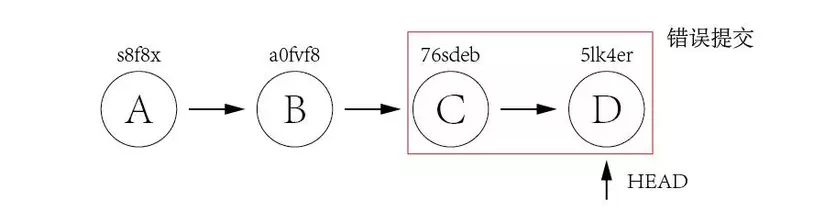
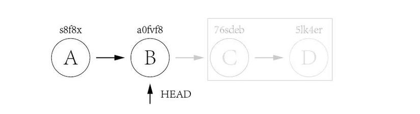
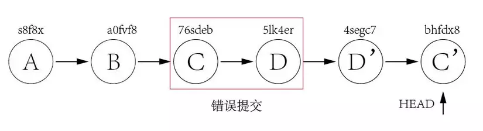

# README #
This is a repository for storing the training of Truong Ngo
## Note for GIT
* Please help appy GitFlow for this reposioty (https://danielkummer.github.io/git-flow-cheatsheet)
* Example:
    - Name for any featues -> `feature/xxx-yyy` . Ex: `feature/implement-login-ui`
    - Name for any bugs -> `bug-fixes/xxx`. Ex: `bug-fixes/wrong-message-when-login`

* When you create a name for the Pull Request, please help set a meaningful name and set description if needed. Should capitalize the first letter and do not use special characters
## Author
* Company: HIKONI Co., Lt
* Website: [https://hikoni.com](https://hikoni.com)

<b>Git reset </b> vs  <b>git revert</b>
In continuous software development, we often cannot get rid of the use but have to rollback some broken commits. In this case, we will have 2 main methods to solve it: <b>git reset </b> and <b> git revert </b>
<ul>
<li> <b>Git reset: </b></li>
Git reset is used to go back to a certain commit point and delete the history of previous commits.
Let's look at the example below to better understand git reset:

Suppose, your commit history has commit points like above (A, B, C ,D) corresponding to the commit_id above. A , B are the active commits, and C and D are the problematic commits. Now you can go back to commit B with the command
<pre>
Git reset --hard a0fvf8
</pre>
After running the above command, we have the following output:

As you can see, the HEAD pointer is pointing to the location of commit B, and the commit history C and D are also gone, like you have never made a faulty commit. The commit history also looks cleaner.
However, these changes only happen on the local repository, to update this change to the remote repository you need to execute the command:
<pre>

Git push -f
</pre>

<li> <b>Git revert: </b></li>
That's with <b> git reset </b> , so what about git revert ?
Git revert doesn't lose commits, instead creates a new commit with the exact same content as the commit you want to revert.

In the same case as with <b>git reset </b>, what we need to do is revert back to commit D, and then revert back to commit C.
<pre>
git revert 5lk4er
git revert 76sdeb
</pre>
Results after running the above 2 commands in turn:

Here, we can see that two new commits D' and C' have been created.
Thus, <b>git reset </b> deletes the commit history to make it look neater, while <b> git revert </b> creates a new commit and keeps the previous commit history
</ul>
<ul>
<li>

 <b> git checkout -b new_branch :  </b> Create a new branch for you
</li>
<li>

 <b> git push -u origin:  </b>  Push a new branch
</li>
<li>

 <b> git checkout ten_branch :  </b> Switch to branch X "Switched to branch 'master'
</li>
<li>

 <b> git pull:  </b> Pull all the latest code
</li>
<li>

 <b> git init :  </b> Effect: Create a new or existing git repository 1 project.
</li>
<li>

 <b> git add :  </b> Effect: Add changes to stage/index in working directory.
</li>
<li>

 <b>  git commit --amend :  </b> Effect: change the name in the last commit eg: git commit --amend -m "New commit message."
</li>
<li>
 <b> Git log --oneline :  </b> Show all commits with id
</li>
<li>

 <b> Git push -f:  </b>Overwrite all commits, use after <b> git reset </b> To go back to reset address and delete previous commits
</li>

<li>

 <b> Git reset <commit_id>: </b> Move the HEAD cursor to the commmit reset position and still <b> preserve all file changes </b>, but remove the changes from the stage.
</li>
<li>

<b>Git reset --soft <commit_id> :</b> This command only moves the HEAD to the commit location. The state of the stage and all changes to the file will be preserved.
 </li>
 <li>
<b> 

Git reset --hard <commit_id> : </b> Move the HEAD cursor to the commmit reset position and discard all changes to the file.

 </li>

 <b> FIX MERGE WHEN COMPLIT ERROR </b>
 <pre>
 <b> git checkout : To master branch "If error uses git branch -D master branch" </b>
</pre>
<pre>
 <b> git pull : To pull the latest code to " </b>
</pre>
<pre>
 <b> git rebase "master branch" : To merge branch </b>
</pre>
 <b> EDIT COMPILED CODE </b>
<pre>
 <b> git add . </b>
</pre>
<pre>
 <b> git commit  </b>
</pre>
</li>

<b> WHEN BI MERGE </b>
<pre>
 <b> Checkout about master branch "If error git branch -D master branch name </b> 
</pre>
<pre>
 <b> git pull to get the latest code  </b> 
</pre>
<pre>
 <b> git checkout to my branch </b> 
</pre>
<pre>
 <b> git rebase master branch : to merge code </b> 
</pre>

<li>
  <pre>
</li>
<li>

 <ul>
 <pre><b> ls  </b> To view folder contents + folder path </pre>
    <li> 
   <pre> <b>ls -R :/<b> List all files inside folders </pre>
    </li>
      <li> 
     <pre> <b>ls -a:/<b> List hidden files </pre>
    </li>
  </ul>

</li>

<li>

<pre>
 <b> Cat  </b> Used to view file content eg: cat file.txt
</pre>
</li>

<li>
  <pre>
 <b> mv :  </b> Used to move files to ... eg : mv file name destination address
</pre>
</li>
<li>
  <pre>
 <b> df :  </b>Check disk space.
</pre>
</li>
<li>
<pre>

 <b> mkdir :  </b> Used to create a new directory eg mkdir Truongngo
</pre>
</li>
<li>
  <pre>
 <b>rmdir :  </b> Used to delete directories eg rmdir directory name "used to delete empty directories"
</pre>
</li>
<li>
  <pre>
<b>  rm :  </b> Used to delete the folder with the content inside
</pre>
</li>
<li>
  <pre>
 <b>touch : </b> Used to create new files via command
</pre>
</li>
<li>
  <pre>
 <b>find: </b> Used to find files in a directory eg find . -name truong.txt
</pre>
</li>
<li>
  <pre>
<b> echo : </b>  Used to transfer data to a file eg echo "context" >> file.txt
</pre>
</li>

<li>
  <pre>
<b> zip : </b>  Used to compress 1 file
</pre>
</li>
<li>
  <pre>
<b> cp : </b> Used to copy 1 or more files to a new directory
</pre>
</li>
<li>
  <pre>
<b> useradd : </b> Used to create more users
</pre>
</li>
<li>
  <pre>
<b> userdel : </b> Above is to add, below must be to delete "Truongngo"
</pre>
</li>
<li>
  <pre>
<b> locate : </b> This command is used to locate the file
 
eg : locate -i truongngo to search for any file that contains truongngo -i to make it case-sensitive
</pre>
</li>
<li>
  <pre>
<b> sudo : </b> used to run commands with root privileges (administrator)
</pre>
</li>

  <b> HOW TO GET OUT OF VIM MODE </b>
  <pre><b> :q!  </b> This command is used to exit without saving inside</pre>
  <pre><b> :qa!  </b> This command is used to exit multiple files at once</pre>
  <pre> <b> :wq  </b> This command is used to exit and save the content </pre>

  <li>
  <pre>
<b> vi of vim : </b> This command is used to edit files at "path"  
<b> note : </b> If the file k exists, it will be considered as creating a new file  

</pre>
</li>

</ul>
<ul>
    <b>Commands when working on terminal  </b>
    <li>
  <pre>
<b> clear : </b> Used to clear the command line window
</pre>
</li>
<li>
  <pre>
<b> date : </b> Used to see the date and time on the system
</pre>
</li>
<li>
  <pre>
<b> call  : </b> Used to view the calendar
</pre>
</li>
</ul>
<ul>
    <b>System management command  </b>
    <li>
  <pre>
<b> rpm : </b> Used to check if a package is installed or not, or install a package, or use to remove a package.
</pre>
</li>
<li>
  <pre>
<b> ps : </b> Check system running process
</pre>
</li>
<li>
  <pre>
<b> sleep  : </b> Used to stop the system from working for a period of time.
</pre>
</li>
<li>
  <pre>
<b> passwd  : </b> Change the password for the user.
</pre>
</li>
<li>
  <pre>
<b> who  : </b> Used to indicate who is logged in to the system.
</pre>
</li>
<li>
  <pre>
<b> man  : </b> Used to view command line instructions such as syntax, parameters...
</pre>
</li>
</ul>
<ul>
    <b>System related commands </b>
    <li>
  <pre>
<b> exit : </b>  Exit the command line window.
</pre>
</li>
<li>
  <pre>
<b> logout : </b> Exit the command line window.
</pre>
</li>
<li>
  <pre>
<b> reboot  : </b> Restart the system.
</pre>
</li>
<li>
  <pre>
<b> halt  : </b>Shutdown
</pre>
</li>

</ul>

